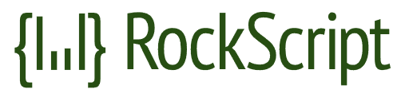
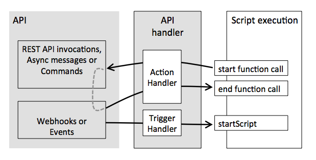
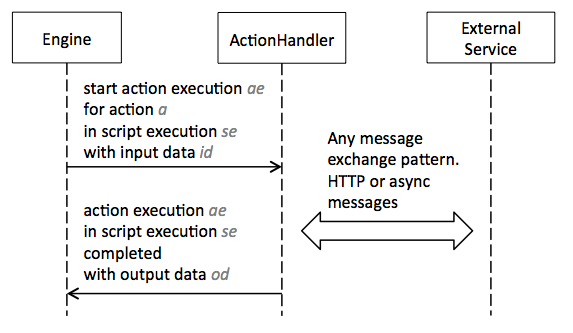

## What it is

A scripting language and server runtime for building event based microservices.

<!--
TODO identify remarkable aspect: inspired by the TED podcast about [How things spread](http://www.npr.org/programs/ted-radio-hour/468877892/how-things-spread).
For things to spread, you need a remarkable aspect.
Think about the video series ‘Does it blend?’, where people blend things like iPhones and other stuff.
It’s to show to others that you have a sense of humor.
We need something remarkable.
-->

## Purpose

The purpose of this software is to make microservice orchestration easier.
Microservice architectures offer the benefit of independent services are easier to develop, but introduces a corresponding coordination cost.
Ultimately, individual microservices must be used together, which requires microservice orchestration or choreography.

<!-- TODO Extract the paragraphs about orchestration vs microservices to a blog post. -->

_Orchestration_ uses a central service, like an orchestra’s conductor, to coordinate the other services.
These other services remain decoupled from each other, and only directly interact with the orchestration service.
This approach is especially convenient for lightweight cloud functions in a serverless architecture.

_Choreography_ can achieve the same goal as orchestration, where each service directly uses each service it depends on.
However, this requires every service developer to share the coordination cost.
With choreography, each service developer must understand how their service participates in the whole, and implement the same coordination patterns as other service developers.

In both approaches - orchestration and choreography - coordination between services is the least fun code to write.
This software implement this coordination functionality, by providing a scriptable orchestration service, so you don’t have to.

This software is intended for service developers, systems integrators and enterprise architects who want a standard approach to microservice orchestration, so they can focus on delivering business services.

## Usage

Write a script `hello.script` that imports an HTTP service and executes an HTTP POST action:

```javascript
var http = system.import('core/http');

http.post({
  url: 'http://api.example.com/greetings',
  content-type: 'application/json; charset=utf-8',
  body: {
    message = 'Hello, world!'
  }
});
```

Then deploy and run the script using the HTTP API, e.g. via cURL on the command line:

```
curl --request PUT --header "Content-Type: application/json" http://localhost:7789/script/hello --data @hello.script

curl --request POST --header "Content-Type: application/json" http://localhost:7789/script/hello/executions --data '{"message":"Hello, world!"}'
```

## Examples

This platform applies to a variety of real-world examples.

* Web application user registration - including waiting for email confirmation
* New employee account creation - creating system accounts in parallel
* E-commerce - reliable order fulfilment and inventory management integration
* Document processing and report generation - multiple data sources and external services

### Web application user registration

Consider web site user registration, where someone first enters an email address on a form.
Your have to wait for the person to confirm the email address via a confirmation link.
A snippet of the script could look like this:

```
emailService.send({
  to: [registrant.email],
  subject: 'Confirm registration',
  body: 'Please click this link http://...'+registrant.code'
});

timeout('24h') {
  var confirmationForm = taskService.completeConfirmationForm();
  identityService.createUserAccount(confirmationForm.email);
}
```

This code shows that you can work with functions whose execution spans a long time.
Function invocations that potentially take a long time are split into
starting the function and completing it asynchronous.

### New employee account creation

Consider a user registration user interface for new employees, with a form for entering an email address.
The user interface submits a user registration form to the back-end services, which execute a user registration script.
Similarly, an identity service API could also trigger user creation by running the same script.

```javascript
var http = system.import('tbn.io/core/http');
var oauth = system.import('tbn.io/core/oauth');
var accounts = system.import('example.com/accounts');
var crm = system.import('example.com/crm');

var emailAddress = execution.input;

var emailResponse = http.post({
  url: 'http://'+server+'/email/send',
  headers: {
    'Authorization': oauth.getAccessToken('Email service')
  },
  body: 'Hi, please click this link...',
  expectedStatus: 200,
  maxRetries: 3
});

var confirmationForm = execution.waitForCallback('Confirmation form');

// Add the user account and CRM record in parallel
execution.parallel {

  accounts.createUser({
    name: confirmationForm.name,
    email: emailAddress,
    passwordHash: confirmationForm.passwordHash
  });

  crm.addUser({
     email: emailAddress,
     name: confirmationForm.name
  });
}
```

This script executes as follows.

1. The user interface executes this script when the user submits an email address.
1. `http`, `accounts` and `crm` are action handlers.
1. `execution` is the object representing the execution, and is used to obtain input data, wait for an external callback, and set output data.
1. The script uses the `http` service’s `post` action to send an HTTP POST to an email service.
1. The email service sends a registration confirmation email with a link.
1. Script execution waits in `execution.waitForCallback` until the user completes the confirmation.
1. The user interface signals to the script engine that the script can continue, passing the `confirmationForm` as data.
1. The script uses the `account` and `crm` services to create user accounts in parallel.

## Features

The script language and server runtime will offer the following features.

### Simplifies and jump starts your event based architecture

Write synchronous code and get asynchronous execution, without having to use a complex concurrency API.
_Futures_ are built on top of languages that don’t natively express concurrency, and make your code more complex.
In our script language, we have a language primitive that waits for an external event, received via a callback.
You can create functions that include non-blocking waits.
During waits, the server does not consume resources such as memory or threads.

### Architectural guidance

We make it easier for you to structure your microservice architecture, by composing orchestration scripts and services.
First wrap the external service APIs that you want to use as a set of actions and triggers in a script.
Next, compose these scripts to make higher level services.
This is a great way to divide and conquer a large software project’s service landscape.

### Extreme visibility

You can track all the details of script execution, because the server stores all execution events using event sourcing.
Without adding logging to your code you can trace every execution step, to a detailed level.
Even in production.
You can also monitor the performance of all external services your service uses.

### Cloud scalability

This project will provide an deployment environment for ‘serverless’ cloud functions, such as AWS Lambda and Google Cloud Functions.

<!-- TODO This may be the wrong trade-off: event sourcing lets us keep executions in memory for performance. Should execution ‘garbage collection’ strategy be an option -->

A script execution only needs to be in memory when it is performing the logic between the actions.
Whenever actions are performed, the script execution is stored in a database (event store).
With this approach, script executions do not take up CPU or memory resources when they are waiting for actions to complete.

An alternative approach is to maximise performance by keeping script executions in memory until they are complete.
This approach, continuing a script execution from a wait state does not require database access.

### Continue execution after a crash

If your script execution crashes, another server can pick up and resume the script _from where it crashed_.

The server stores script execution state using event sourcing.
At every point during execution, the stored events save the execution state.
The server can resume execution by reloading the stored events.

If your system crashes while executing a script, the script execution can resume from the point where it crashed when the server boots up again.
In a clustered deployment, an execution can even resume on another node in the cluster.
This is an alternative for transactions on cloud infrastructures because it gives eventual consistency.

### Transactions alternative

Because the server stores script execution events, you can use it to replace transactions in an HTTP microservices context.
The server remembers which requests have been started and which have been completed.
The ability to resume interrupted scripts means that you can be sure that all requests will be performed eventually.

You will have to take into account idempotence of interactions with other services, but there is no other alternative for inter-process communication over HTTP.
HTTP requests can not participate in transactions.
The only thing you can do is track when you start a request and store the result when a request finishes.

When the script server crashes, another server instance can pick up and resume script execution at the point where the execution crashed.
This way, you are sure that your script completes eventually and that all of the services in the orchestration will be called sucessfully at least once.

### Simplified concurrency

Enforcing a combination of sequential and parallel execution can become incredibly difficult, especially when applying event driven patterns.
The script language has a straightforward way to specify when actions can be executed in parallel.
The engine will coordinates invoking the next action.

Script execution persistence is based on event sourcing.
This gives you detailed information for each execution for debugging, or audit for the complete script execution lifetime.
This includes the whole execution’s start and end times, as well as start and end times for actions, variables and parameter values.
Since script executions are stored in a database, you can query for statistics such as how long a certain action or script takes on average.

### Step back in debugger

The script engine’s event store makes it possible to step back in time while debugging.
You can replay events up to an earlier point in the execution and resume from there.

## Benefits

### Parallel and sequential execution

In the script language, you can specify which requests have to be performed in parallel and which have to be performed in sequence.
The script engine will keep track of synchronisation.

### Retries and error handling

When building cloud systems, you cannot do without comprehensive error handling, retries and failover.
This is cumbersome code to write in any programming language, especially for a distributed system.
The script language has good defaults and allows you to configure specific timeouts, retries and failover
behavior.
This helps you build resilient applications on the cloud.

### Readable script language

The script language requires the least amount of input for the execution to work.
Scripts are easier to write by hand and easier to read than asynchronous code in general purpose languages.
Language drivers provide builders that give compile time guidance for creating scripts.

### Pluggable

The script API includes built in actions, such as HTTP actions for sending HTTP requests.
If you want to use other protocols or APIs, you can extend the script language by defining your own custom actions.

### Scalable

The script engine is designed to run in public and private cloud environments and is built on proven scalable
cloud technology.
All HTTP interactions use non-blocking I/O for optimized performance.

### Testable

Scripts can be tested like any other piece of software.
You can do this from your own language, such as Java, or use the provided test runner, which can run test specifications.

## Alternatives

The platform shares many concepts with [OpenWhisk](http://openwhisk.org/), which also offers an
architectural basis for on reactive, event based systems.

It’s like [IFTTT](https://ifttt.com/), but for developers.
Instead of a UI, it offers a scripting language to work with actions and triggers.
Actions and triggers are configurable interactions with an external API.

The scripting language we offer has similar capabilities
to [AWS step functions](https://aws.amazon.com/step-functions/).

## How it works

A script typically belongs to a service and contains the logic of how this service reacts on an event in another system.



### Triggers

A trigger represents an event that an API emits that can be used to start an action script execution.

Examples of triggers:

* A file was uploaded to some folder
* A database record was updated

### Actions

An *action* represents an interaction with an API to an external system.

It can be a single HTTP request or a more complex message exchange pattern.
Actions can potentially take a long time to complete.

The action script execution engine has the ability to wait asynchronous for
an action to complete.
During that waiting time, the execution is persisted
and it will be resumed when the action indicates it’s done.

Examples of actions:

* Create a PDF document
* Send an email
* An approval performed by a person
* Perform a credit rating check
* Send a REST API request

### Scripts

A script coordinates actions.
Script executions are persisted and have a built-in syntax for parallel execution,
resulting in four main features/benefits described above:

1. Crash recovery
2. Scalability
3. Simplified concurrency
4. Visibility

### Action handlers

An action handler acts as a bridge between the script and the external service.
It offers a single logical operation to an external service as a function in the
action script.
Each time the script engine
has to execute an action, the script engine sends a notification (and optionally
input data) when the action starts.
And the script engine expects a callback
from the action handler when the action completes.




# Use cases

Use this platform when you have to coordinate several services, or when service execution has to wait for external systems (or humans!) to complete actions.

<!--
TODO turn these into examples, each with a concrete scenario, and move them there
-->

### Coordinating microservices and people

Consider a collection of microservices and people.
Scriptable microservice orchestration is ideal when you are implementing a service that represents an execution flow spanning other services and people.

The scripts express the interaction patterns that you use to communicate with external systems, such as synchronous HTTP invocation, HTTP send and HTTP callback or asynchronous messages.
In the script, these interaction patterns look like function invocations.

In an execution flow, there is always one system or person responsible for making
progress.
When an external system or person becomes responsible, the script will wait until the external service is finished and has sent a callback.
During the wait state, the execution state is persistent so either no thread or memory resources are being consumed while waiting, or the persistent state remains in memory and execution can continue without database access.

### Avoiding callback hell

In asynchronous architectures, you are forced to work with functions or lamdas as callbacks.
It’s easy to lose the overview. For example:

```javascript
function sendUpdateRequest(payload) {
  messageQueue.send('someQueue', payload);
}

function receiveUpdateResponse(response) {
  // do stuff with the response
}
```

When code has a lot of these callbacks the result is hard to read, understand and maintain.

Scripts allow you to write that overview in a much more readable way.

Write:

```javascript
var emailAccount = userAccountService.createEmailAddress(userDetails);

var teamChatAccount = teamChatService.createAccount(emailAccount.emailAddress);
```

Instead of writing:

```javascript
userAccountService.createEmailAddress(userDetails).done(function(emailAccount) {
  var teamChatAccount = teamChatService.createAccount(emailAccount.emailAddress);
});
```

## Project information

### Status

Currently developing the initial concepts and building the minimum viable product.

We are not yet seeking external code contributions, but welcome discussion about use cases.

### Contributors

[Tom Baeyens](https://github.com/tombaeyens) and [Peter Hilton](http://github.com/hilton).

### Contributor License Agreement (CLA)

[Contributor License Agreement (CLA)](CLA.md) - created based on https://cla.github.com/agreement.
We use https://cla-assistant.io/ to guide people in signing the CLA.

### History

This project has a link with workflow.
The founders have a long track record in workflow systems, but realized that workflow was not ideal for developers.
Workflows have a visual representation usually of boxes and arrows.
On the other hand, workflows represent an execution flow and can have wait states.
We realized that developers do not need the visual diagram representation.

Writing and maintaining workflow scripts becomes a lot easier when offering the underlying features of workflow systems as a scripting language.

# License

RockScript is licensed under the [Apache License 2.0](LICENSE).
