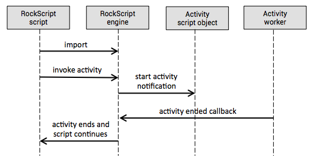
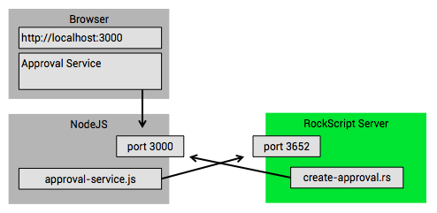

## Why use it

 * __Resilient script execution__
 * __Support for including long running activities__  
 * __Used for microservice orchestration__
 * __Valuable component in event driven architectures__
 * __Easier to read compared to reactive code with callbacks__

The syntax of RockScript is based on JavaScript, so it will be very familiar 
to you.
  
RockScript adds the notion of an [Activity](#activity-workers).  In the script, 
an activity looks like a function invocation but they are executed asynchronously 
by an [Activity Worker](#activity-workers) component.  Activities can be long running: 
from milliseconds, to days or even months.  The script execution will not block any thread 
or memory resources while it is waiting for an activity completion callback.
So you can write reactive code without the typical callback hell or other 
synchronization hassles as in other programming languages.   

But the cool part is that executions are resilient.  The runtime state of 
each script execution is stored with event sourcing as the script executes.
So script executions can _survive RockScript server crashes_.  It's designed 
so that a group of RockScript servers can form a cluster. 

## When to use it

**Event listeners**: RockScript is ideal for implementing event listeners in 
an event driven architecture.  That's because your server often needs to perform 
multiple integration activities in response to an incoming event.  Often 
these integrations happen over HTTP and cannot participate in a transaction.  
If you code these integrations in other programming languages, execution is not 
crash-proof.  So the overall system may get inconsistent if your server crashes 
half way during the integration activities.  You also don't have a way  to 
know which scripts have crashed and at which point they stopped.  

RockScript ensures that script executions recover from server crashes and from 
the stored runtime script execution state you can analyse what has happened.
This capabilities make RockScripts a viable alternative for transactions.

**Long running activities**: RockScript allows you to write scripts that 
are include long running activities like document transformations, 
user tasks, waiting for clicking a confirmation link, report generations, 
big file transformations, long running map reduce jobs, etc.  Also any API 
operation can be wrapped as a RockScript activity.

## Activity workers

**An activity** is a function that is executed by an activity worker. When an activity 
starts, the engine notifies the activity worker that a new activity has to be started. 
After that notification, the RockScript engine will wait for a callback from the activity 
worker.  During this time, the RockScript engine will not block a thread or memory.

An **activity worker** is the component responsible for executing activities.  
It's really easy to add activity workers to an engine via an activity script object.

An **activity script object** is a script object that is imported into the script and 
exposes one or more activities in the script.  The activity script object will 
get a notification when an activity has to be started.  The activity script object 
passes the activity start message on to the activity worker.  The activity worker 
is then responsible for invoking the callback to indicate when an activity ends.  



## Usage by example

#### Prerequisites

 * Java 8 (to run the RockScript server)
 * Maven 3.3.9 (to build the engine)
 * NodeJS 7.7.1 (to run the example)

#### The approval example setup



#### Starting the RockScript server

Build the engine with 

```
mvn -Pizza clean install
```

Start the RockScript server with 

```
java -jar server/target/rockscript.jar
```

You should see output like this

```
59,868 INFO Server -  ____            _     ____            _       _    
59,868 INFO Server - |  _ \ ___   ___| | __/ ___|  ___ _ __(_)_ __ | |_  
59,869 INFO Server - | |_) / _ \ / __| |/ /\___ \ / __| '__| | '_ \| __| 
59,869 INFO Server - |  _ < (_) | (__|   <  ___) | (__| |  | | |_) | |_  
59,869 INFO Server - |_| \_\___/ \___|_|\_\|____/ \___|_|  |_| .__/ \__| 
59,869 INFO Server -                                         |_|         
00,021 INFO Server - Server started on 3652
```

_**Limitation**: Bear in mind that for now, this only has an in-memory event store.
So each time you reboot the server, it looses all it's scripts and script executions._

#### The create-approval.rs script

In the directory `docs/examples/approvals`, look at the contents of the `create-approval.rs` script

```javascript
var http = system.import('rockscript.io/http');
var approvalService = system.import('localhost:3000');

var chuckResponse = http.get({url:'http://api.icndb.com/jokes/random'});

approvalService.approve(chuckResponse.body.value.joke);
```

`http.get(...);` in line 4 will perform a HTTP request and makes 
a HTTP response object available in the script.  For this particular URL,
the response object looks like this:

```json
{ "status": 200,
  "headers": { 
    "Transfer-Encoding": ["chunked"],
    "other": "irrelevant properties"
  },
  "body": {
    "type": "success",
    "value": {
      "joke":"When God said, &quot;let there be light&quot;, Chuck Norris said, &quot;say 'please'.&quot;",
      "other": "irrelevant properties"
    }
  }
}
```

`approvalService.approve` in line 6 will wait till a user confirms the approval 
of the given statement in the approval service.  There's more on the approval service 
below.

The script ends after the approval is given in the approval service.  Adding approval 
return data and doing something with it afterwards is left as a challenge for the 
reader :)

### Deploying the script

Before we can run the script, we have to deploy it into the RockScript server.
Deploy `create-approval.rs` with the following command

```
curl -X POST --data-binary @create-approval.rs localhost:3652/scripts
```

The output on the console shown by curl contains the script id.  It looks something 
like this:

```
{"id":"s1"}
```

#### The http activity worker

The `http` activity worker is built into the engine itself.  It uses a separate 
threadpool to perform the HTTP requests.  But when executing the example script, 
it's quite fast so you might not notice it's being executed asynchronous.

#### The approval service

`approval-service.js` is an activity worker and a simple webapp at the same time. 
The webapp allows a user to approve statements.  

The approval service demonstrates:  

  1) That you can make activity worker available over http
  2) That activities can take a long time to complete

The script adds a statement to the service for approval.  And the approval ends when 
someone clicks on the Approve button next to the statement.

Start the approval service with the command 

```
node approval-service.js
```  

You should see

```
Approval service listening on port 3000.  Point your browser to http://localhost:3000
```

Open [http://localhost:3000](http://localhost:3000)  That page refreshes itself every 
second and shows all the approvals.  

#### Running the script 

Running the `create-approval.rs` that we deployed earlier can be done with the following command: 

```
curl -X POST -H Content-Type:application/json -d {startScript:{scriptId:"s1"}} localhost:3652/command
```

This assumes that the id of the deployed script was `s1`.  In case you redeploy or deploy 
other scripts, use the script id as returned from the script deployment.

You will see in the logs of the server that the script will be executed up till the approval
activity is started.  The last line will show that the approval activity is waiting.

On the approval webapp, you will now see a new statement appear with an 'Approve' button 
next to it.
  
You can rerun the same command and start a few times the same scripts.  Each script 
execution will lead to a statement being added.

Each time you click on the 'Approve' button next to a statement, you will see in the 
logs of the RockScript server that the corresponding script executions ends. 

### Project stage

RockScript is experimental stage and very early in its development.

**RockScript does not offer any stability guarantees at this point.**
  
We are looking for feedback and use cases:  

[Create an issue](https://github.com/RockScript/server/issues/new) for 
any question, suggestion or other feedback.  We really appreciate it.

### License

The RockScript runtime server is Apache License V2.  

### Commercial offerings

**RockScript consulting** gets you in depth expertise help you use RockScript in your project.  We have 
discount pricing for consulting that helps you evaluate if RockScript is a good fit.  

The **RockScript Devtool** is a web based tool that provides convenience for developers.  This tool is 
free, but not open source.  You have to register and provide us with your contact details in order 
to get it.  (planned)

The **RockScript Manager** is a commercial extension of the dev tool to monitor and administer 
production RockScript servers.  (later)

**RockScript Service** is a SaaS version of the server and includes development tool, 
monitoring and administration.  (later)  

### Alternatives

RockScript is an alternative for 

 * [AWS step functions](https://aws.amazon.com/step-functions/)
 * [Netflix conductor](https://github.com/Netflix/conductor)
 * [Microsoft logic apps](https://azure.microsoft.com/en-us/services/logic-apps/)
 * BPM and workflow
