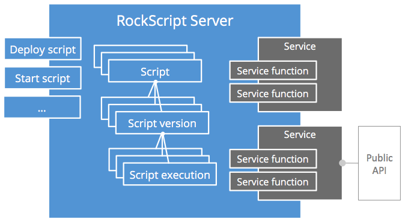

RockScript is scripting engine to coordinates service invocations. You write scripts that 
invoke services.  The RockScript engine executes the scripts resilient and non-blocking.

RockScript is the better alternative for using message queues.  When you want to combine 
multiple service invocations you can't use plain code because your server could crash while 
some invocations have succeeded and some may not have started yet.  The typical way to 
deal with this is message queues. But using message queues, you have to cut your code into 
individual message handlers, configure your code to queues and it quickly becomes really 
hard to understand the overall logic.  With RockScript it's easy to read your business logic 
in the scripts. 

Because RockScript does persistent, non-blocking execution of service functions, they
can be *long running*.  Service function invocations can take seconds to days or
even months without any problem.  No memory or thread resources are consumed by the
RockScript server while waiting for a service function to complete.

Because RockScript language is a subset of JavaScript, it's really easy to perform data
transormations between service function invocations.

For more reasons why and when to use RockScript, see <a onclick="show('why-and-when')">Why and 
when</a>

## The RockScript language

The RockScript language is a subset of JavaScript. For example:

```javascript
var http = system.import('rockscript.io/http');
var approvalService = system.import('localhost:3000');

/* get is a service function on the built-in http service */
var chuckResponse = http.get({url:'http://api.icndb.com/jokes/random'});

/* approve is a service function on the external approval service */
approvalService.approve(chuckResponse.body.value.joke);
```

For more details about which subset of JavaScript is supported, see 
<a onclick="show('language')">RockScript language</a>

## Terminology

The *RockScript server* is the server that manages scripts and script executions.



A *script* on the server has multiple *script version*s of one can be the active 
script version.  The *active script version* is the version that is used when a 
script is started.  A script is identified by its name.

*Deploying* a script means saving a script version (with the <a onclick="show('save-script')">saveScript</a>)
command with `activate:true` so that this new version becomes will be used for 
subsequent script executions.

A *script execution* is one execution of a script version.  

Scripts and script executions are sufficient to <a onclick="show('getting-started')">get started</a>
and <a onclick="show('tutorial')">get your first script running</a> using the built-in 
services. Read on if you want to know the terminology to make your own services 
available as functions in RockScript.   

A *service* makes external API, system, service or functionality available as functions 
in the RockScript engine. A *service function* is a single RCP style operation that 
can be invoked in the script like a normal function.

A *service object*, like eg `http` and `approvalService` in the example above, is 
the script object that exposes the service functions to the script.