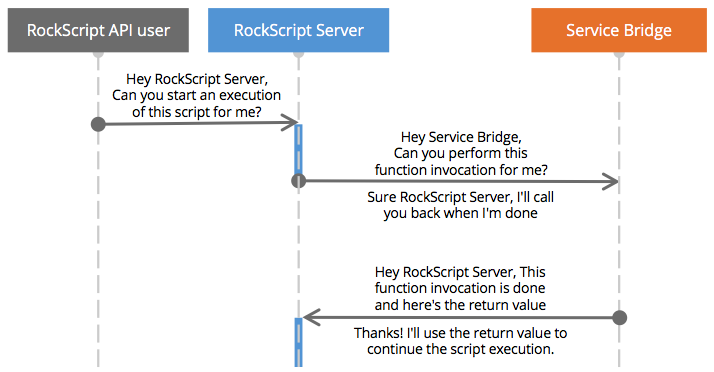

The services SPI represents the communication protocol between the RockScript engine 
and the service bridge.  Service bridges often translate between the RockScript 
services SPI protocol and a REST API to make the REST API functionality available 
as a service function in RockScript.

The next sequence diagram represents the most common scenario: 

  

The <span style="color:#3F80CD">blue sections</span> on the *RockScript Server* 
line indicate when it's executing the script.  In between the 2 blue sections
the complete execution state is in the event store and no threads nor memory 
are consumed.

The next diagram shows the same but in more technical words

  

For the `startScript` command, please refer to the 
<a onclick="show('start-script')">Start script API docs</a>.

## Import URL is service bridge base URL

To import a service, all you need to do is import the URL of the 
service bridge.  The server will prepend `http://` if that's not 
already present.  For example:

```javascript
var myService = system.import('mycompany.com/hello');

myService.hello('world');
``` 

## 1) Start service function invocation

The request to the service bridge

## 2) Function invocation end callback

This request is documented in <a onclick="show('end-function')">End function command</a>

## Function execution error

Alternatively to the callback that ends the function invocation, the service 
bridge can also let the server know that there's an error.  Optionaly 
the service bridge can ask to retry the service function invocation 
some specified time in the future.  

For details, see <a onclick="show('function-error')">Service function error command</a>

